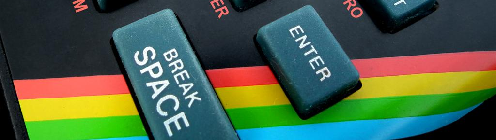

eight-bit algorave livecoding

 * Generate a sound you like at [sfxr.me](http://sfxr.me/).
 * Click "Serialize" and copy the JSON definition.
 * Paste into the app's text-box to generate EDN.
 * Add to [scratch.cljs](./src/speccy/scratch.cljs) and edit to add time dependent changes.

Here's an example synth:

	; bloopy synth
	(add! (fn [t]
	  (if (= (mod t 2) 0)
	    {:p_env_decay 0.393
	     :p_env_sustain 0.698
	     :p_lpf_ramp -0.8234398365020752
	     :p_duty_ramp 0.001362761133350432
	     :p_hpf_ramp 0.00417931517586112
	     :p_freq_dramp 0.322
	     :p_pha_offset -0.5764224529266357
	     :p_arp_speed 0.776
	     :p_arp_mod 0.746
	     :p_freq_ramp 3.2808253536131815e-7
	     :p_pha_ramp 0.01807297021150589
	     :p_duty 0.09206738322973251
	     :p_lpf_resonance 0.4376702308654785
	     :p_repeat_speed 0.7718144655227661
	     :p_env_attack 0.03691735118627548
	     :p_lpf_freq 0.9774251580238342
	     :wave_type (mod (mod (mod t 7) 21) 2)
	     :p_vib_strength 0.0367879644036293
	     :p_base_freq (* 1 ([0.102 0.204 0.153] (int (mod (/ (mod t 7) 2) 3))))
	     :p_env_punch 0.499
	     :p_hpf_freq 0.07438796013593674
	     :p_vib_speed 0.1444406509399414})))

 * Listen, modify, repeat.

